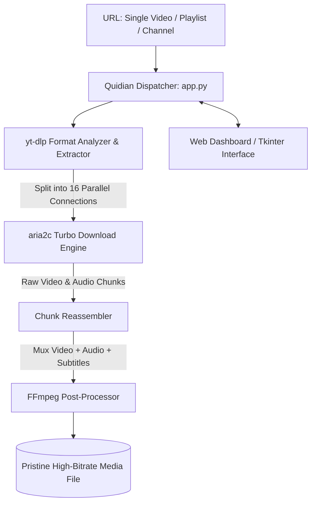

# 🎬 Quidian — All-in-One 4K Media & Playlist Turbo Downloader

<div align="center">

[](LICENSE)
[](https://github.com/Kamran5H/Quidian-MediaDownloader)
[](https://github.com/yt-dlp/yt-dlp)
[](https://aria2.github.io/)
[](https://github.com/Kamran5H/Quidian-MediaDownloader)

**Enterprise-grade media acquisition suite powered by yt-dlp, multi-connection aria2c acceleration, automated subtitle extraction, and modern web & desktop dashboards.**

[Features](#-key-features) • [Architecture](#-architecture) • [Supported Formats](#-supported-formats--resolutions) • [Quickstart](#-quick-start) • [License](#-license)

</div>

---

## 🌟 Executive Overview

**Quidian Media Downloader** is a high-performance media downloader engineered to extract videos, audio tracks, full playlists, and multi-language subtitles from 1,000+ streaming sites. By pairing **yt-dlp** with **aria2c multi-connection acceleration** (up to 16 concurrent HTTP/HTTPS segments per file) and automated **FFmpeg post-processing**, Quidian achieves maximum saturation of high-speed internet connections while preserving pristine 4K/8K HDR video and uncompressed audio.

---

## 🚀 Key Features

- **⚡ aria2c Turbo Multi-Threading**: Splits downloads across 16 parallel socket streams, achieving up to 10x faster download speeds than standard browser downloads.
- **🎬 Complete Resolution Spectrum**: Flawlessly downloads 1080p, 2K, 4K, and 8K HDR at 60 FPS with VP9, AV1, or H.264 codecs.
- **📑 Multi-Language Subtitle Extractor**: Automatically retrieves embedded and auto-generated subtitles, translating and saving them in pristine `.srt` or `.vtt` format.
- **🎵 Lossless Audio Extraction**: Extracts pristine MP3, M4A, FLAC, and WAV audio streams with embedded album art and metadata.
- **📋 Batch & Playlist Ingestion**: Ingests complete YouTube playlists, course catalogs, or channel archives with automated index numbering and resume support.
- **🖥️ Dual Interface Options**: Run via an interactive modern Web GUI dashboard or launch the lightweight desktop client with `run.bat`.

---

## 🏗️ Architecture



---

## 📁 Repository Structure

```text
Quidian-MediaDownloader/
├── app.py                      # Primary web dashboard server & API controller
├── run.bat                     # Turnkey Windows desktop launcher
├── setup_studio.bat            # Automated dependency installer
├── launch_quidian_media.vbs    # Silent background launcher
├── Video_Downloader/           # Dedicated video extraction engine
├── Subtitle_Downloader/        # Multi-language subtitle parser
├── engines/                    # yt-dlp, aria2c, and FFmpeg wrappers
├── templates/ & static/        # Web dashboard UI assets and styling
├── requirements.txt            # Python dependencies
├── .gitignore                  # Media cache & output exclusions
└── LICENSE                     # Open-source MIT License
```

---

## ⚡ Quick Start

### 1. Installation
```bash
git clone https://github.com/Kamran5H/Quidian-MediaDownloader.git
cd Quidian-MediaDownloader

# Run automated Windows setup
setup_studio.bat
```

### 2. Launch
Double click [`run.bat`](run.bat) or execute:
```bash
python app.py
```
Open [http://localhost:5000](http://localhost:5000) to start downloading media at maximum speeds!

---

## 📜 License

This project is open-source and released under the [MIT License](LICENSE).  
Copyright (c) 2024-2026 **Kamran Ashraf**.
